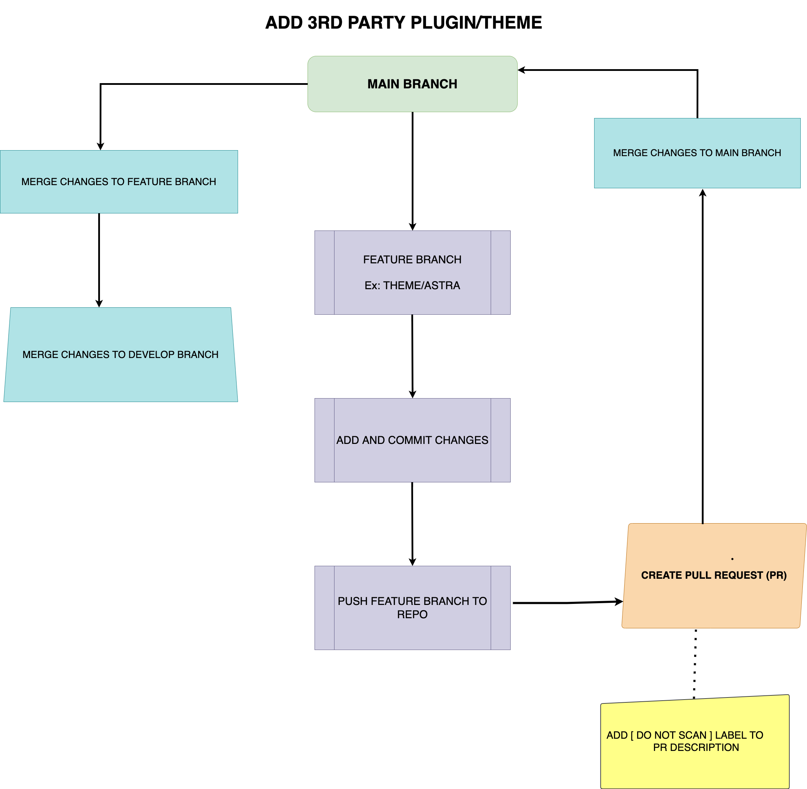
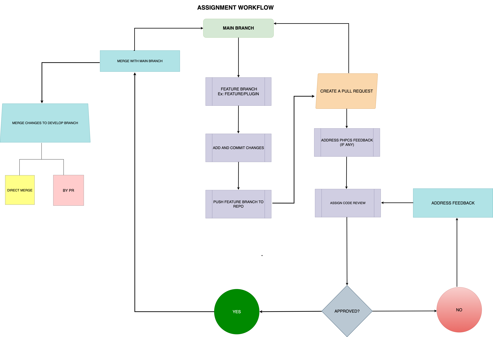
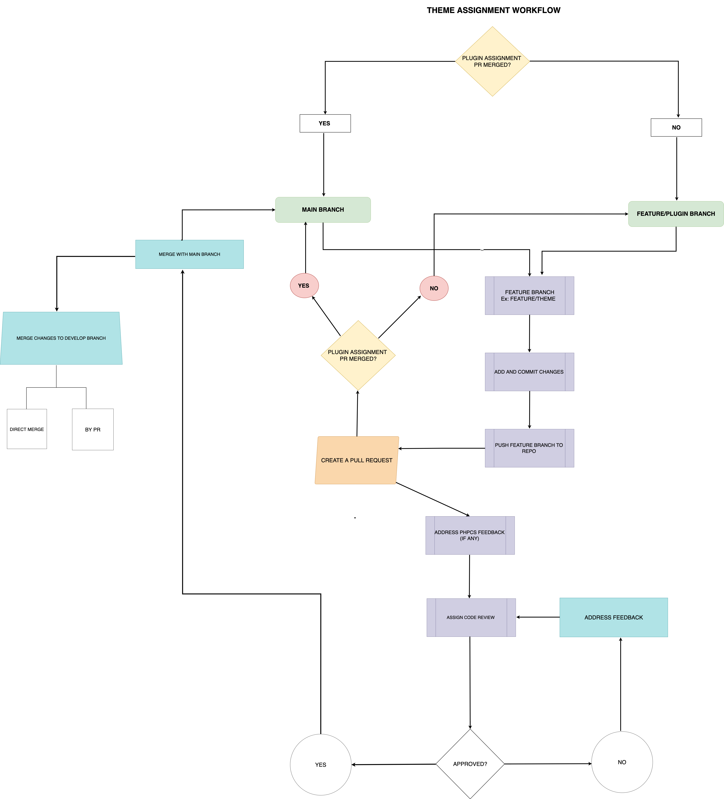
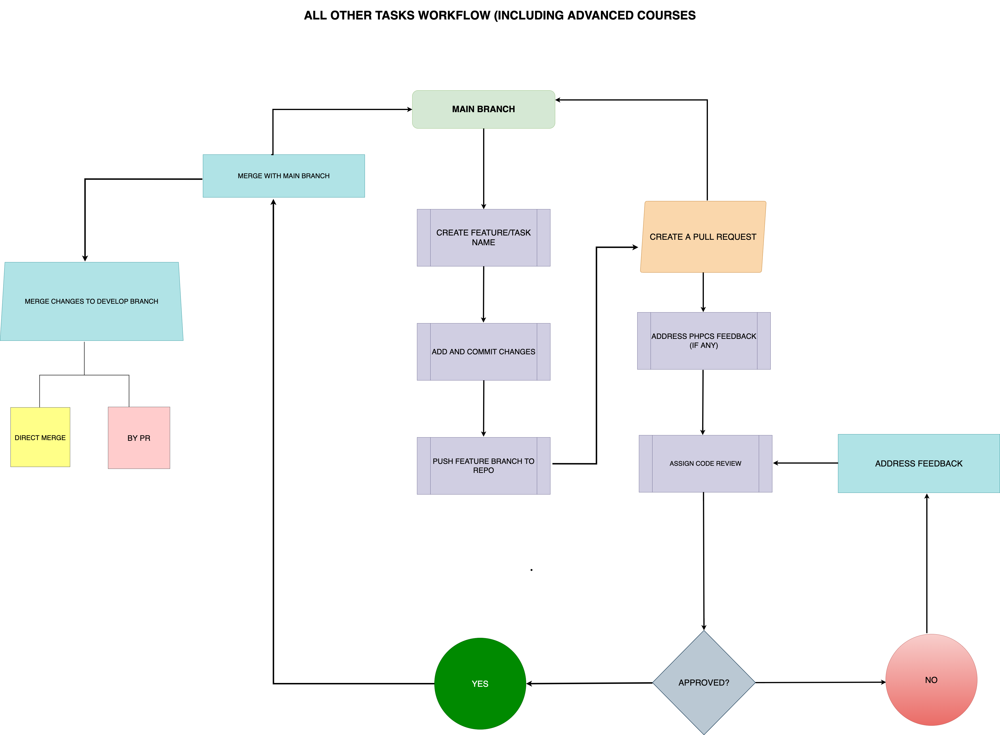

# Development Workflow

## Local Development Environment
For local development we use [Lando](https://lando.dev).

### Installation
https://docs.lando.dev/getting-started/installation.html

Lando may ask for permission to mount home directory. If you don't want to mount the home directory please [check this comment](https://github.com/lando/lando/issues/2635#issuecomment-877473886).

Landofile (`.lando.yml`) is already part of the movie-library-assignment.

For a quick start, go to your cloned repository and run
```shell
lando start
```

[How to resolve SSL error in the browser?](https://lando.dev/blog/2020/03/20/5-things-to-do-after-you-install-lando.html#_1-allowlist-the-lando-ca-for-no-ssl-warnings)

### How this works?
As soon as you run `start` command, you will notice that a new directory called `wordpress` and `uploads` got created.

Changes made in the following locations will automatically get synced to the WordPress site in real time.
```
.lando/wp-cli.yml
./mu-plugins
./plugins
./rt-config
./themes
./uploads
```

Refer Limitations below to understand more.

### Basic commands for Lando
https://docs.lando.dev/cli/

### Lando WordPress Recipe
https://docs.lando.dev/wordpress/

### Limitations
This is a base Lando configuration. Files & directories other then defined above will not get syned automatically from `wordpress/wp-content` to your local repository. You can update your Landofile accordingly for the same.

## Default Branch

`main`

## Branch naming convention

- For bug - `fix/issue-name` For example, `fix/phpcs-errors`
- For feature - `feature/issue-name` For example, `feature/add-plugin`

## Pull Request and issue notes

- PR Title
  - If the PR fixes a single issue, Title should be same as Issue title. Also add issue number before title. For example, `GH-3 Setup initial theme`.

  - If the PR fixes more than 1 issues, Title should be the category of issues the PR fixes. For example, `WordPress Development Basic Assignments` or `Basic Plugin Assignments`
- Add proper description.
- Assign reviewer.
- Create draft pull request for work in-progress PR and don't add `WIP:` in PR title.
- PR should have one approval.

## Workflow to add third-party plugins and themes

- Create new branch from `main` branch.
- Add third-party themes or plugins in that new branch.
- Push the new branch and create PR against `main` branch. Also, add `[do-not-scan]` label in PR description to prevent PHPCS scan for third-party plugins or themes.
- Merge the PR in `main` branch.
- Merge the `main` branch into `develop` branch.
- Merge the `main` branch into featured branch you have created.



## Common Workflow

- For deployment, you can merge your feature/fix branch to `develop` branch. After pushing changes to `develop` branch, codebase will be deployed to development site.

## Workflow for `WordPress Development Basics` Course Tasks

### Prerequisite
- Update `phpcs.xml` to adopt the project requirements, you can modify PHPCS rules by setting certain sniff properties in your ruleset.
- Make sure to update text_domin property in `phpcs.xml` file, replace placeholders `text-domain-1` and `text-domain-2` with your plugin or theme's text domain. [Learn More](https://github.com/WordPress/WordPress-Coding-Standards/wiki/Customizable-sniff-properties#internationalization-setting-your-text-domain)


### Plugin Assignment

- Create `feature/plugin` branch from `main` branch and push the branch.
- Work on `feature/plugin` branch for plugin assignment tasks and keep pushing changes to repo.
- Once plugin assignment tasks completed, raise the pull request against `main` branch.
- Follow the `Pull Request and issue notes` guidelines mentioned below when you raise pull request.
- Once pull request raised, PHPCS scan will run, and it will add feedback if any.
- Once you have addressed PHPCS feedback (if any) then request for code review.
- If you don't know to whom you need to request for code review then ask L&D team or trainer.
- If code reviewer has requested changes, then address feedback in same branch, push changes and re-request for code review.
- Once pull request approved then merge it into `main` branch.



### Theme Assignment

- Create `feature/theme` branch from either `main` or `feature/plugin` branch and push the branch.
  - If your plugin assignment pull request not approved and merged to `main` branch when you start working on theme assignment then create `feature/theme` branch from `feature/plugin` branch because theme assignment is dependent on plugin you have developed.
  - If your plugin assignment pull request approved and merged to `main` branch when you start working on theme assignment then create `feature/theme` branch from `main` branch.
- Work on `feature/theme` branch for theme assignment tasks and keep pushing changes to repo.
- Once theme assignment tasks completed, raise the pull request against `main` or `feature/plugin` branch.
  - If your plugin assignment pull request not approved and merged to `main` branch then raise the pull request against `feature/plugin` branch because your `feature/theme` branch do have plugin codebase and if you raise pull request against `main` branch then in pull request diff, plugin codebase also show which don't needed in theme assignment pull request as plugin assignment being reviewed in separate PR.
  - If your plugin assignment pull request approved and merged to `main` branch then raise the pull request against `main` branch.
- Follow the `Pull Request and issue notes` guidelines mentioned below when you raise pull request.
- Once pull request raised, PHPCS scan will run, and it will add feedback if any.
- Once you have addressed PHPCS feedback (if any) then request for code review.
- If you don't know to whom you need to request for code review then ask L&D/training team.
- If code reviewer has requested changes, then address feedback in same branch, push changes and re-request for code review.
- Once pull request approved then merge it into `main` branch.
  - If pull request raised against `feature/plugin` branch then wait until plugin assignment pull request merged into `main` branch. Once it's merged then update theme assignment pull request base from `feature/plugin` to `main` branch and then merge it into `main` branch.



## Workflow for Advance Plugin/Theme, Other Courses Tasks

- Create `feature/{issue-name}` branch from `main` branch and push the branch.
  - Create separate branch for each task.
- Work on `feature/{issue-name}` branch for assignment task and keep pushing changes to repo.
- Once assignment task completed, raise the pull request against `main` branch.
- Follow the `Pull Request and issue notes` guidelines mentioned below when you raise pull request.
- Once pull request raised, PHPCS scan will run, and it will add feedback if any.
- Once you have addressed PHPCS feedback (if any) then request for code review.
- If you don't know to whom you need to request for code review then ask L&D/ Training Team.
- If code reviewer has requested changes, then address feedback in same branch, push changes and re-request for code review.
- Once pull request approved then merge it into `main` branch.


