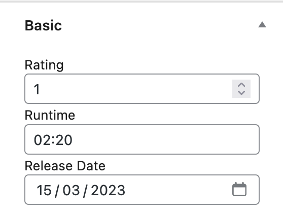
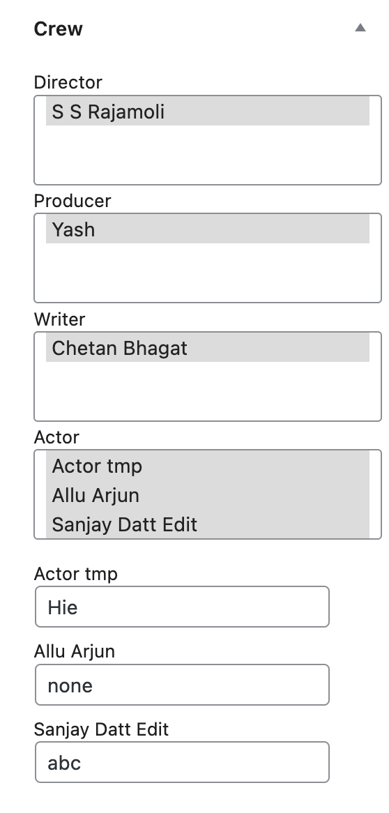
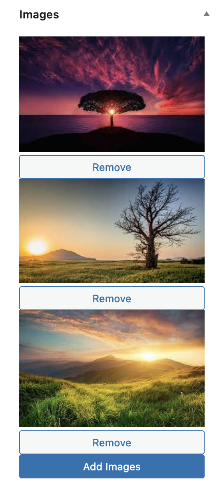
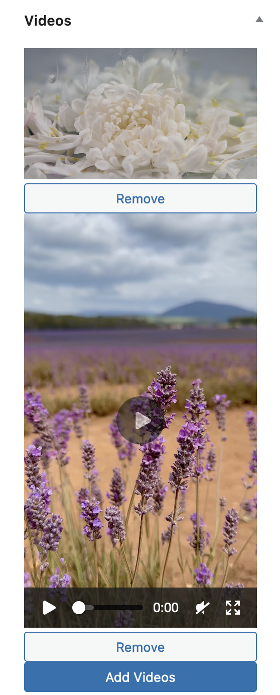

# Movie Library Plugin

It helps to create a movie library with movie and person custom post types. It supports different taxonomies and custom fields like genre, label, language, etc taxonomies and rating, runtime, director, producer, etc custom fields. It also provides the movie and person shortcode to quick filter and display the movie and person list.

## Screenshots

<div>
    
    
    
    
</div>

## Tools and Requirements

- Local by Flywheel or Lando


## Installation

- This project is built using `lando` development environment.
- Run `lando start` to deploy the docker containter and bring the project live. This command also show the URLs for different sevices like nginx appserver, mailhog, and mariadb. Use those URLs to get live demo.
- Run `lando destroy` to delete the docker containter and project.
- If you want to just pause the process and want to preserver data, then use `lando stop` and `lando restart` instead of above command.
- `lando ssh` to get the endpoint of server cli.
- `lando info` to get URL of different services provided by lando.

## Skeleton

```
movie-library/
├── README.md
├── admin
│   └── js
│       ├── character-name-handler.js
│       ├── image-upload-handler.js
│       ├── movie-library-admin.js
│       └── video-upload-handler.js
├── class-autoloader.php
├── class-movie-library.php
├── custom-post-type
│   ├── class-movie.php
│   └── class-person.php
├── images
│   ├── Crew.png
│   ├── Images.png
│   ├── Rating.png
│   └── Videos.png
├── language
│   └── movie-library.pot
├── meta-box
│   ├── class-basic-meta-box.php
│   ├── class-crew-meta-box.php
│   ├── class-images-meta-box.php
│   ├── class-person-basic-meta-box.php
│   ├── class-social-meta-box.php
│   └── class-videos-meta-box.php
├── movie-library.php
├── plugin-constant.php
├── setting
│   └── class-setting.php
├── shadow-taxonomy
│   └── non-hierarchical
│       └── class-shadow-person.php
├── shortcode
│   ├── class-movie-shortcode.php
│   └── class-person-shortcode.php
├── taxonomy
│   ├── hierarchical
│   │   ├── class-career.php
│   │   ├── class-genre.php
│   │   ├── class-label.php
│   │   ├── class-language.php
│   │   └── class-production-company.php
│   └── non-hierarchical
│       └── class-tag.php
└── uninstall.php
```

## Author

Name: [rtCamp](https://github.com/rtCamp) \
Company: [rtCamp](https://github.com/rtCamp)